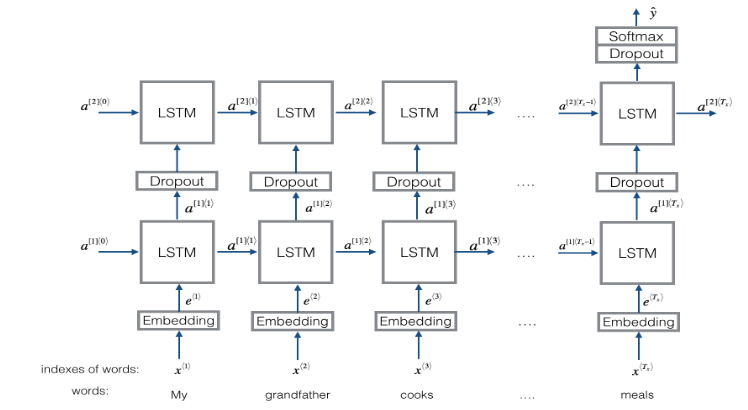

# HarveyHurricane_Fake_News_Detection
This is a research project from NYU CUSP. We trained a LSTM sequence model with Keras to predict fake news along with their spread during the Hurricane Harvey. Since we don't have a big training set, we used a pre-trained GLoVE embedding matrix from Stanford University (Common Crawl (840B tokens, 2.2M vocab, cased, 300d vectors, 2.03 GB download): [glove.840B.300d.zip](http://nlp.stanford.edu/data/glove.840B.300d.zip))

# Architecture
Thanks to the sequence model class that I took given by Andrew Ng, Deeplearning.ai, I used the example architecture at first and modified it to make it suitable in our case.  

# Data
We obtained our unlabeled [raw data](https://webarchive.library.unt.edu/thumbs/harvey_twitter_dataset.tar ) from University of North Texas which contains all "harvey" related tweets during the hurricane. Then we manually labeled them into Fake and True. For now we have about 1000 tatal usable samples.

# Result
For now, we get an test accuracy of 0.8115183199263368 which is not acceptable. We are now working on obtaining more training samples.  
And we also played with some self-created fake tweets and it turns out that the model performs decently on them.  

Self-created sentence: "There is a crocodile in the flood" | Prediction: 0  
Self-created sentence: "Donald Trump donated 1 billion" | Prediction: 0  

# Reference
- Sequence Model class from Coursera given by Andrew Ng
- Jeffrey Pennington, Richard Socher, and Christopher D. Manning. 2014. [GloVe: Global Vectors for Word Representation](https://nlp.stanford.edu/pubs/glove.pdf). 